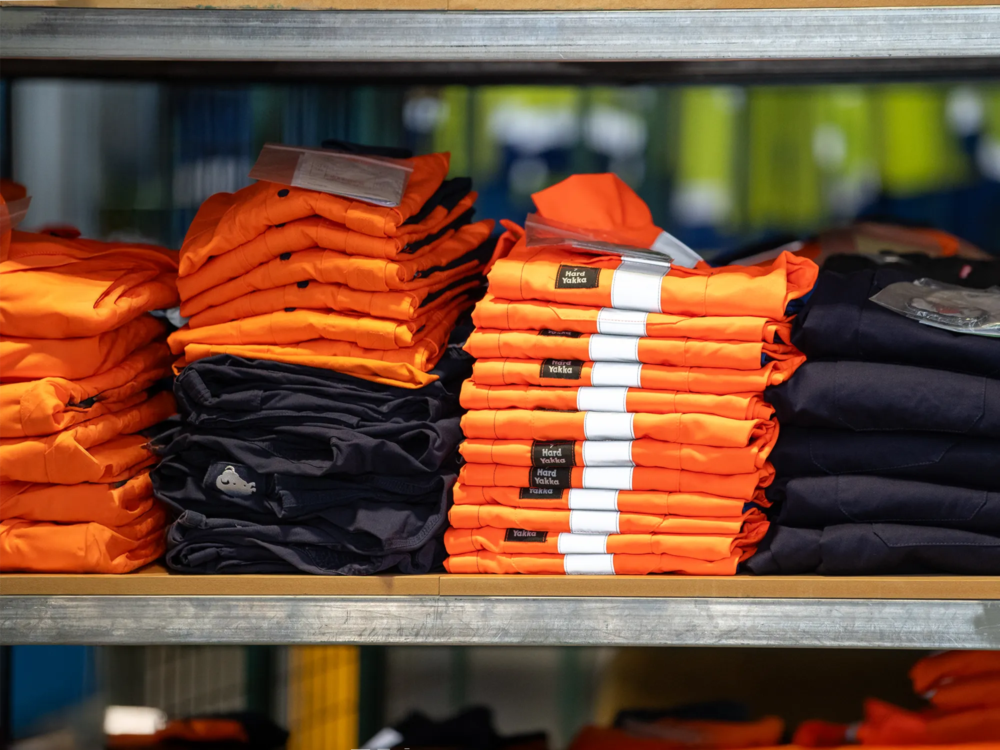

# Claude Code Reference - Apparel Master HTML

## Unified Class System

This document tracks the unified class structure created for cleaner, backend-friendly HTML.

---

## Bold Content Section

**Location in CSS:** `/css/main.css` lines 2982-3085

**Purpose:** Generic, reusable content section that can be used anywhere on any page. Features a two-column layout with an image on one side and text content with an orange decorative bar on the other. Perfect for Laravel Blade templates and CMS integration.

### Old Classes → New Classes Mapping

| Old Classes                    | New Class                | Description                       |
| ------------------------------ | ------------------------ | --------------------------------- |
| `content-section py-5`         | `bold-content`           | Section wrapper with all padding  |
| `container content-container`  | `bold-content-container` | Container with responsive padding |
| `content-image-col`            | `content-image-col`      | Image column wrapper (unchanged)  |
| `content-image`                | `content-image`          | Image element (unchanged)         |
| `content-text-col`             | `bold-content-text-col`  | Text column wrapper               |
| `content-text`                 | `bold-content-text`      | Text content wrapper              |
| `content-bar`                  | `content-bar`            | Orange decorative bar (unchanged) |
| `svg-width` (eco-policy only)  | `svg-width`              | Optional SVG wrapper (unchanged)  |

### Complete Class Reference

#### `.bold-content`

**Merges:** `content-section` + `py-5`

**Styles:**

- Mobile: `padding-top: 1.5rem; padding-bottom: 1.5rem;`
- Desktop (≥1200px): `padding-top: 3rem; padding-bottom: 3rem;`

**Usage:**

```html
<section class="bold-content"></section>
```

---

#### `.bold-content-container`

**Merges:** `container` + `content-container`

**Styles:**

- `max-width: 1720px; margin: 0 auto;`
- Mobile: `padding: 0 20px`
- Desktop (≥1200px): `padding: 0 40px`
- Wide (≥1920px): `padding: 0`

**Usage:**

```html
<div class="container bold-content-container"></div>
```

---

#### `.content-image-col`

**Original class (unchanged)** - Image column wrapper

**Usage:**

```html
<div
  class="col-xl-6 d-flex align-items-center content-image-col order-1 order-xl-0"
></div>
```

---

#### `.content-image`

**Original class (unchanged)** - Image element with aspect ratios

**Usage:**

```html

```

---

#### `.bold-content-text-col`

**Merges:** `content-text-col`

**Styles:**

- Mobile: `justify-content: flex-start`
- Desktop (≥1200px): `justify-content: center`

**Usage:**

```html
<div
  class="col-xl-6 d-flex align-items-center bold-content-text-col order-0 order-xl-1"
></div>
```

---

#### `.bold-content-text`

**Merges:** `content-text`

**Styles:**

- `text-align: left`
- Desktop (≥1200px): `max-width: 532px`
- Paragraph styles:
  - Mobile: `font-size: 18px; line-height: 26px; font-weight: 500`
  - Desktop: `font-size: 20px; line-height: 30px`
  - Font: Inter, sans-serif
  - Color: #000

**Usage:**

```html
<div class="bold-content-text">
  <div class="bold-content-bar mb-4"></div>
  <p>Content here...</p>
</div>
```

---

#### `.content-bar`

**Original class (unchanged)** - Orange decorative bar

**Usage:**

```html
<div class="content-bar mb-4"></div>
```

---

#### `.svg-width`

**Original class (unchanged)** - Optional SVG logo wrapper (eco-policy only)

**Usage (optional):**

```html
<div class="svg-width">
  
</div>
```

---

## Complete HTML Example

### Standard Version (Most Pages)

```html
<section class="bold-content">
  <div class="container bold-content-container">
    <div class="row">
      <!-- Image Column (left on desktop) -->
      <div
        class="col-xl-6 d-flex align-items-center content-image-col order-1 order-xl-0"
      >
        
      </div>

      <!-- Text Column (right on desktop) -->
      <div
        class="col-xl-6 d-flex align-items-center bold-content-text-col order-0 order-xl-1"
      >
        <div class="bold-content-text">
          <div class="content-bar mb-4"></div>
          <p>Your content text here...</p>
        </div>
      </div>
    </div>
  </div>
</section>
```

### With Optional SVG Logo (eco-policy.html)

```html
<section class="bold-content">
  <div class="container bold-content-container">
    <div class="row">
      <div
        class="col-xl-6 d-flex align-items-center content-image-col order-1 order-xl-0"
      >
        
      </div>
      <div
        class="col-xl-6 d-flex align-items-center bold-content-text-col order-0 order-xl-1"
      >
        <div class="bold-content-text">
          <!-- Optional SVG logo -->
          <div class="svg-width">
            
          </div>
          <div class="content-bar mb-4"></div>
          <p>Your content text here...</p>
        </div>
      </div>
    </div>
  </div>
</section>
```

---

## Pages Using Bold Content Section

1. **ppe.html** (line 696) - ✅ Updated to new classes
2. **food-industry-workwear.html** (line 698) - ✅ Updated to new classes
3. **workplace-floor-mats.html** (line 698) - ✅ Updated to new classes
4. **eco-policy.html** (line 704) - ✅ Updated to new classes (with optional SVG)

**All 4 pages now use the unified bold-content class system!**

---

## Bootstrap Classes to Keep

Always keep these Bootstrap utility classes:

- `container` - Bootstrap container wrapper
- `row` - Bootstrap row wrapper
- `col-xl-6` - Column width (responsive, stacks on mobile)
- `d-flex` - Flexbox display
- `align-items-center` - Vertical centering
- `order-1 order-xl-0` - Mobile order 1, desktop order 0 (image left on desktop)
- `order-0 order-xl-1` - Mobile order 0, desktop order 1 (text right on desktop)
- `mb-4` - Margin bottom (for orange bar)

---

## Notes

- **bold-content** is a generic, reusable section that can be used anywhere without conflicts
- All custom classes are consolidated into single, unified classes with responsive behavior built-in
- No need for multiple custom classes on same element (except Bootstrap utilities)
- Perfect for Laravel Blade templates and CMS integration
- Original classes remain in CSS for backward compatibility with other pages
- This pattern appears on 4 pages total (first content section after breadcrumb)
